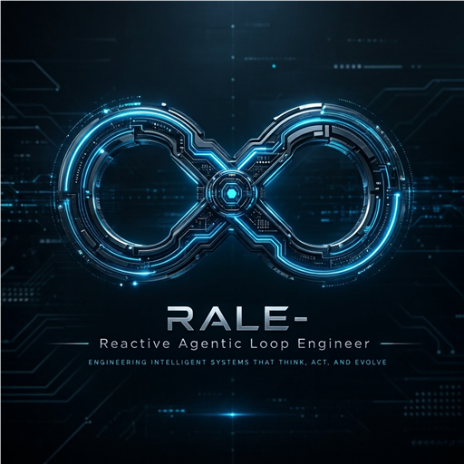

<p align="center">
  
</p>

# Reactive Agentic Loop Engineer

<!-- mcp-name: io.github.chrispulman/reactive-agentic-loop-engineer-mcp-server -->

Reactive Agentic Loop Engineer (RALE) is a production-oriented C# Model Context Protocol server scaffold for decomposing large prompts into persisted, goal-bounded work loops.

The server uses .NET 10, `ModelContextProtocol` 1.4.0, `ReactiveUI.Primitives`, EF Core SQLite, and TUnit on Microsoft.Testing.Platform.

## Quick Install

Click to install in your preferred environment:

[](https://vscode.dev/redirect/mcp/install?name=reactive-agentic-loop-engineer-mcp-server&config=%7B%22type%22%3A%22stdio%22%2C%22command%22%3A%22dnx%22%2C%22args%22%3A%5B%22CP.Reactive.Agentic.Loop.Engineer.MCP.Server%401.*%22%2C%22--yes%22%5D%7D)
[](https://insiders.vscode.dev/redirect/mcp/install?name=reactive-agentic-loop-engineer-mcp-server&config=%7B%22type%22%3A%22stdio%22%2C%22command%22%3A%22dnx%22%2C%22args%22%3A%5B%22CP.Reactive.Agentic.Loop.Engineer.MCP.Server%401.*%22%2C%22--yes%22%5D%7D&quality=insiders)
[](https://vs-open.link/mcp-install?%7B%22name%22%3A%22CP.Reactive.Agentic.Loop.Engineer.MCP.Server%22%2C%22type%22%3A%22stdio%22%2C%22command%22%3A%22dnx%22%2C%22args%22%3A%5B%22CP.Reactive.Agentic.Loop.Engineer.MCP.Server%401.*%22%2C%22--yes%22%5D%7D)

> **Note:** These install links are prepared for the intended NuGet package identity `CP.Reactive.Agentic.Loop.Engineer.MCP.Server`.
> If the latest package has not been published yet, use the manual source-build configuration below.

## What RALE Provides

- Persisted loops, goals, agents, goal results, and append-only loop events.
- A reactive `Signal<Goal>` pipeline for ready-goal emission.
- Prompt decomposition that never emits a goal whose `Prompt.Length` exceeds the configured limit.
- Agent-card registration with capabilities, capacity profile, trust posture, task types, SLA, endpoint, and least-privilege tool scopes.
- On-demand capacity discovery through agent endpoints with TTL-based cache/profile fallback.
- Master-plan decomposition into capacity-fit subtasks assigned to candidate agents with serial or parallel dependency graphs.
- Governance gates for trust level, task type support, required tool scopes, and human approval.
- Bounded reactive-loop recovery through heartbeats, iteration limits, and capacity-mismatch re-splitting.
- Optimistic database concurrency for goal claiming so duplicate execution is rejected.
- Goal pause/resume and complete/fail transitions.
- MCP tools for loop creation, agent registration, capacity discovery, master-plan creation, dispatch, approval, completion, pause, resume, heartbeat, and re-splitting.
- TUnit tests covering decomposition, persistence, ready-goal emission, claiming, completion, pause/resume, capacity fallback, governance, dispatch, and re-splitting.

## Repository Layout

```text
src/RALE.Server/
  Program.cs
  Data/
    RALEContext.cs
    RaleDatabaseInitializer.cs
    Migrations/
  Models/
  Services/
    LoopEngineer.cs
    AgentExecutor.cs
    OrchestrationEngineer.cs
    HttpAgentCapacityClient.cs
    PromptDecomposer.cs
  Tools/
    RaleLoopTools.cs
    RaleOrchestrationTools.cs
    RaleDtos.cs
tests/RALE.Tests/
images/
  rale-image.ico
  rale-image.png
  rale-package-icon.png
.mcp/server.json
skills/RALE/SKILL.md
```

## MCP Tools

| Tool | Purpose |
| --- | --- |
| `rale_create_loop` | Create a loop and decompose the primary prompt into ordered goals. |
| `rale_get_loop` | Fetch a loop and its goals. |
| `rale_list_goals` | List ordered goals for a loop. |
| `rale_claim_next_goal` | Claim the next ready goal with optimistic concurrency. |
| `rale_complete_goal` | Persist a result, complete a goal, and emit dependent goals. |
| `rale_pause_goal` | Pause a pending or in-progress goal. |
| `rale_resume_goal` | Resume a paused goal and re-emit when ready. |
| `rale_register_agent` | Register an agent card with capabilities, capacity, trust, task types, endpoint, and tool scopes. |
| `rale_list_agents` | List registered agents with load and cached capacity metadata. |
| `rale_discover_agent_capacity` | Query live agent capacity and fall back to cached/profile capacity when needed. |
| `rale_create_master_plan` | Create a capacity-fit multi-agent plan with serial or parallel dependencies and governance metadata. |
| `rale_assign_next_task` | Assign the next ready task for an agent while enforcing load, dependency, policy, and approval gates. |
| `rale_approve_goal` | Approve or reject a goal blocked by a human approval gate. |
| `rale_record_goal_heartbeat` | Persist execution heartbeat/provenance for long-running agent loops. |
| `rale_resplit_goal` | Replace a capacity-mismatched goal with smaller dependency-preserving subtasks. |

## Database Schema

SQLite tables:

- `Loops`: primary objective, status, token limit, execution pattern, constraints, artifacts, priority, deadline, iteration limit, optimistic version.
- `Goals`: sequence, description, bounded prompt, JSON dependencies, assigned agent, task type, artifacts, approval state, policy state, retry and iteration limits, status, optimistic version.
- `Agents`: agent card metadata, endpoint, current load, trust level, tool scopes, capacity cache, optional assigned goal.
- `AgentEvents`: append-only audit trail for registration, capacity discovery, and capacity fallback.
- `GoalResults`: output, JSON metadata, completion time.
- `LoopEvents`: append-only audit trail for loop and goal transitions.

The schema is initialized through EF Core migrations at server startup.

## Installation

### Requirements

- .NET 10 SDK
- An MCP-capable client such as VS Code, Visual Studio, Claude Desktop, or another MCP 1.x host

### Install as a .NET tool

Once the NuGet package is published:

```powershell
dotnet tool install -g CP.Reactive.Agentic.Loop.Engineer.MCP.Server
```

Then configure your MCP client:

```json
{
  "type": "stdio",
  "command": "reactive-agentic-loop-engineer-mcp-server"
}
```

### Install via `dnx`

Use the badge links at the top of this file, or configure manually:

```json
{
  "type": "stdio",
  "command": "dnx",
  "args": ["CP.Reactive.Agentic.Loop.Engineer.MCP.Server@1.*", "--yes"]
}
```

### Manual configuration from source

Clone the repository and configure your MCP client to launch the server from source:

```json
{
  "name": "reactive-agentic-loop-engineer-mcp-server",
  "type": "stdio",
  "command": "dotnet",
  "args": [
    "run",
    "--project",
    "/path/to/ReactiveAgenticLoopEngineer/src/RALE.Server/RALE.Server.csproj"
  ]
}
```

### Run from source

```powershell
dotnet run --project src/RALE.Server/RALE.Server.csproj
```

By default RALE stores SQLite data at:

```text
src/RALE.Server/bin/<Configuration>/net10.0/data/rale.db
```

Override it with configuration key `ConnectionStrings:RALE`.

## Test

```powershell
dotnet test ReactiveAgenticLoopEngineer.slnx -c Debug
```

Coverage with Microsoft.Testing.Platform:

```powershell
dotnet test ReactiveAgenticLoopEngineer.slnx -c Debug --results-directory TestResults -- --coverage --coverage-output TestResults/coverage.cobertura.xml --coverage-output-format cobertura
```

## Operational Notes

- Keep logs on stderr for stdio MCP transport.
- Treat MCP tool inputs as untrusted; tool methods validate required values and use `McpException` for client-visible validation errors.
- Keep `tokenLimit` conservative. RALE currently treats the limit as a character ceiling and exposes `EstimateTokens` for a conservative 4-chars-per-token estimate.
- Subscribers may receive the same pending goal event more than once; executors must claim before executing. Only one claim succeeds.
- Persisted results and loop events allow crash recovery and audit inspection.
- Register agents before creating a master plan. RALE requests live capacity from `GET /agents/{id}/capacity?taskProfile=...` when an endpoint is configured, then falls back to fresh cached capacity or the registered profile.
- Use `rale_create_master_plan` for multi-agent work. It stores policy violations on each generated goal and blocks assignment until `rale_approve_goal` clears human approval gates.
- Use `rale_record_goal_heartbeat` for long-running agent loops and `rale_resplit_goal` when an agent reports capacity mismatch. Re-splitting is bounded by each goal's iteration limit.
